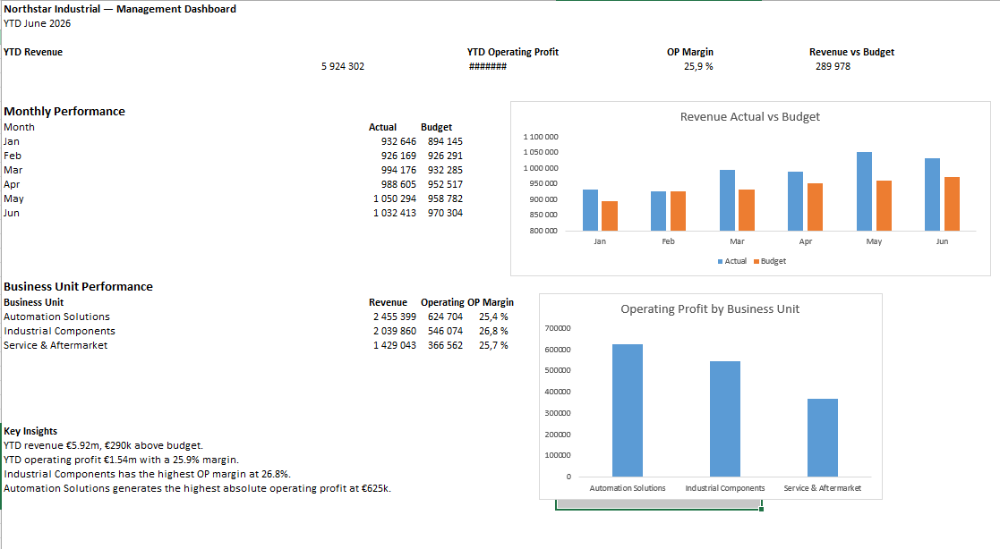
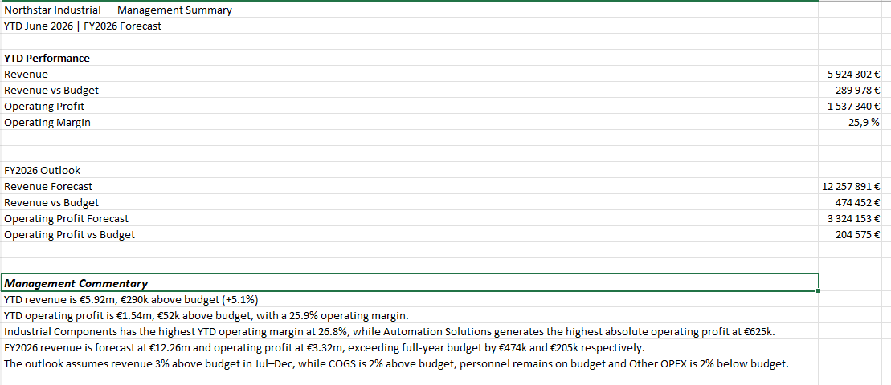

# Northstar Industrial — Financial Model

Excel-based management reporting and forecasting model built for a fictional industrial company.

The project transforms transaction-level actual and budget data into a structured management P&L, variance analysis, full-year forecast, business unit profitability analysis, and management dashboard.

## Project Overview

The objective was to build a practical financial reporting model that allows management to:

- Compare actual performance against budget
- Identify monthly and YTD variances
- Forecast full-year financial performance
- Analyze profitability by business unit
- Summarize key financial insights for management decision-making

## Tools

- Microsoft Excel
- SUMIFS
- XLOOKUP
- Structured Excel tables
- Financial modelling and variance analysis
- Scenario-based forecasting
- Data visualization

## Model Structure

The workbook is structured into several connected components:

### Actuals and Budget
Transaction-level actual data is mapped into management P&L categories and aggregated by month. Budget data provides the baseline for performance comparison.

### Management P&L
Monthly actual and budget figures are summarized into Revenue, COGS, Gross Profit, Personnel, Other OPEX and Operating Profit.

### Variance Analysis
Actual performance is compared against budget on both a monthly and YTD basis using absolute and percentage variances.

### Forecast
Jan–Jun uses actual results. Jul–Dec is forecast from the monthly budget using adjustable assumptions for revenue and cost development.

### Business Unit Analysis
Revenue, costs, operating profit and operating margin are analyzed across three business units to identify differences in profitability.

### Management Dashboard
The dashboard summarizes YTD revenue, operating profit, operating margin, budget performance and business unit performance.

### Management Summary
A concise management view combines YTD performance, the FY2026 outlook and key financial observations.

## Key Results

For the first six months of 2026:

- YTD revenue: **€5.92m**
- Revenue vs budget: **+€290k (+5.1%)**
- YTD operating profit: **€1.54m**
- Operating margin: **25.9%**
- Industrial Components achieved the highest operating margin at **26.8%**
- Automation Solutions generated the highest absolute operating profit at approximately **€625k**

Based on the forecast assumptions, the FY2026 outlook is:

- Revenue forecast: **€12.26m**
- Operating profit forecast: **€3.32m**
- Revenue vs full-year budget: **+€474k**
- Operating profit vs full-year budget: **+€205k**

- ## Dashboard

## Management Summary

